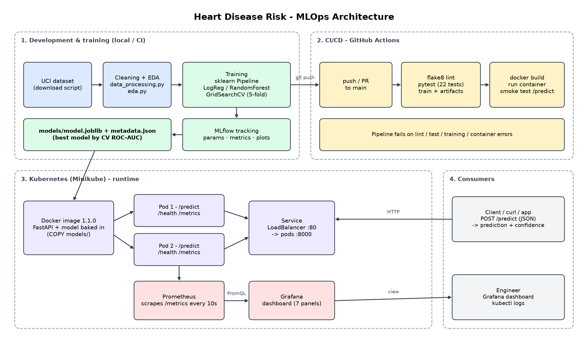

# Heart Disease Risk Prediction - MLOps Pipeline

End-to-end MLOps project (BITS Pilani, MLOps AIMLCZG523, Assignment 01): a classifier that predicts
heart disease from the UCI Heart Disease dataset, delivered with experiment tracking, automated
tests and CI/CD, a Docker container, a Kubernetes deployment and Prometheus/Grafana monitoring.

**Full write-up:** [`reports/report.pdf`](reports/report.pdf) (source: [`reports/report.md`](reports/report.md))

| Result | Value |
|---|---|
| Selected model | Logistic Regression (`C=0.1`, balanced) |
| 5-fold CV ROC-AUC | 0.903 +/- 0.017 |
| Hold-out test | accuracy 0.885, precision 0.839, recall 0.929, ROC-AUC 0.965 |



## Quick start

```bash
python -m venv .venv && source .venv/bin/activate
pip install -r requirements.txt

python -m src.download_data      # download UCI data -> data/raw/
python -m src.data_processing    # clean             -> data/processed/
python -m src.eda                # EDA figures       -> reports/figures/
python -m src.train              # tune + evaluate + log to MLflow + save models/model.joblib
pytest && flake8 .               # 22 tests + lint
```

MLflow UI: `mlflow ui --backend-store-uri sqlite:///mlflow.db` (http://127.0.0.1:5000)

## Serve the model

```bash
# locally
uvicorn src.api:app --port 8000

# in Docker
docker build -t heart-disease-api:1.1.0 .
docker run -p 8000:8000 heart-disease-api:1.1.0
```

```bash
curl -X POST localhost:8000/predict -H 'Content-Type: application/json' -d '{
  "age":63,"sex":1,"cp":1,"trestbps":145,"chol":233,"fbs":1,"restecg":2,
  "thalach":150,"exang":0,"oldpeak":2.3,"slope":3,"ca":0,"thal":6}'
# {"prediction":0,"label":"no disease","probability_disease":0.4598,"confidence":0.5402}
```

| Endpoint | Description |
|---|---|
| `POST /predict` | 13 clinical features (JSON) -> prediction, probability, confidence |
| `GET /health` | health check |
| `GET /metrics` | Prometheus metrics |
| `GET /docs` | Swagger UI |

## Deploy to Kubernetes (Minikube)

```bash
scripts/deploy_minikube.sh                 # start cluster, build + load image, apply k8s/
kubectl apply -k k8s/monitoring            # Prometheus + Grafana
minikube service heart-disease-api --url   # API URL
```

Prometheus is on NodePort 30090 and Grafana (dashboard "Heart Disease API") on NodePort 30300 of the
Minikube IP. On Minikube the `LoadBalancer` service only gets an external IP while
`minikube tunnel` is running; otherwise use the URL above.

## CI/CD

`.github/workflows/ci.yml` runs on every push/PR: flake8 -> data download -> pytest -> training
(uploading model, test report, logs and MLflow store as artifacts) -> Docker build and container
smoke test of `/predict`. Any failing step fails the pipeline.

## Repository layout

```
src/                 download, cleaning, EDA, features, models, train, tracking, predict, api
tests/               pytest unit tests (22)
data/                raw/ and processed/ datasets
models/              model.joblib + model_metadata.json
k8s/                 deployment.yaml, service.yaml, monitoring/ (Prometheus, Grafana, dashboard)
scripts/             deploy_minikube.sh, build_report.py, make_architecture_diagram.py
reports/             report.md / report.pdf, figures/, deployment and monitoring evidence
screenshots/         MLflow, GitHub Actions, Swagger, Prometheus, Grafana
```

Rebuild the report PDF with `python scripts/build_report.py` (needs Chromium).

> Educational project only - not a medical device and not validated for clinical use.
