# Heart Disease Risk Prediction - An End-to-End MLOps Pipeline

**Course:** Machine Learning Operations (MLOps) AIMLCZG523 - Assignment 01
**Author:** Alchemist-evo
**Code repository:** <https://github.com/Alchemist-evo/ML_ops1>

---

## 1. Introduction

This project builds a classifier that predicts the presence of heart disease from routine clinical measurements, and delivers it the way a production ML system would be delivered: reproducible training, tracked experiments, automated tests and CI, a containerised REST API, deployment on Kubernetes, and live monitoring.

The emphasis is on the **pipeline**, not on squeezing the last point out of the model. Every stage is scripted and can be re-run from a clean checkout:

| Stage | Tooling | Where |
|---|---|---|
| Data acquisition and cleaning | `requests`, pandas | `src/download_data.py`, `src/data_processing.py` |
| EDA | matplotlib, seaborn | `src/eda.py` |
| Modelling and tuning | scikit-learn | `src/features.py`, `src/models.py`, `src/train.py` |
| Experiment tracking | MLflow | `src/tracking.py` |
| Packaging | joblib, pinned requirements | `models/`, `requirements*.txt` |
| Testing and CI/CD | pytest, flake8, GitHub Actions | `tests/`, `.github/workflows/ci.yml` |
| Serving | FastAPI, Uvicorn | `src/api.py` |
| Containerisation | Docker | `Dockerfile` |
| Deployment | Kubernetes (Minikube) | `k8s/` |
| Monitoring | Prometheus, Grafana | `k8s/monitoring/` |

## 2. Setup and Installation

**Prerequisites:** Python 3.14, Git; Docker, Minikube and kubectl for the deployment steps.

```bash
git clone https://github.com/Alchemist-evo/ML_ops1.git && cd ML_ops1
python -m venv .venv && source .venv/bin/activate
pip install -r requirements.txt

python -m src.download_data      # UCI download -> data/raw/
python -m src.data_processing    # cleaning     -> data/processed/
python -m src.eda                # figures      -> reports/figures/
python -m src.train              # tune, evaluate, log to MLflow, save best model
pytest                           # 22 unit tests
flake8 .                         # lint

mlflow ui --backend-store-uri sqlite:///mlflow.db     # http://127.0.0.1:5000
uvicorn src.api:app --port 8000                       # local API
```

**Docker:**

```bash
docker build -t heart-disease-api:1.1.0 .
docker run -p 8000:8000 heart-disease-api:1.1.0
curl -X POST localhost:8000/predict -H 'Content-Type: application/json' \
  -d '{"age":63,"sex":1,"cp":1,"trestbps":145,"chol":233,"fbs":1,"restecg":2,"thalach":150,"exang":0,"oldpeak":2.3,"slope":3,"ca":0,"thal":6}'
```

**Kubernetes (Minikube):** `scripts/deploy_minikube.sh` starts the cluster, builds and loads the image and applies `k8s/`. Monitoring is added with `kubectl apply -k k8s/monitoring`.

**Clean-room check.** To confirm the "runs from a clean setup" requirement, the repository (without the virtualenv, data or model) was copied to a fresh directory, a new virtualenv was created, and only `requirements.txt` was installed. Download, cleaning and training then reproduced exactly the same metrics (test ROC-AUC 0.965 and 0.948). The same steps run on a fresh GitHub Actions runner on every push.

## 3. Data and Exploratory Data Analysis

### 3.1 Dataset

The **UCI Heart Disease (Cleveland)** dataset contains 303 patients, 13 clinical features and a diagnosis label. The original label is 0 (healthy) or 1-4 (increasing severity of disease); it is collapsed to a binary target, *disease present* vs *absent*, as required. The download script fetches the file directly from the UCI repository, so the raw data is never edited by hand.

| Feature | Meaning | Type |
|---|---|---|
| age | Age (years) | numeric |
| sex | 1 = male, 0 = female | categorical |
| cp | Chest-pain type (1-4) | categorical |
| trestbps | Resting blood pressure (mm Hg) | numeric |
| chol | Serum cholesterol (mg/dl) | numeric |
| fbs | Fasting blood sugar > 120 mg/dl | categorical |
| restecg | Resting ECG result (0-2) | categorical |
| thalach | Maximum heart rate achieved | numeric |
| exang | Exercise-induced angina | categorical |
| oldpeak | ST depression induced by exercise | numeric |
| slope | Slope of peak exercise ST segment (1-3) | categorical |
| ca | Major vessels coloured by fluoroscopy (0-3) | categorical |
| thal | Thalassemia: 3 normal, 6 fixed, 7 reversible | categorical |

### 3.2 Cleaning

- Missing values are encoded as `?` in the raw file. There are only six: four in `ca` and two in `thal`. They are read as NaN and imputed with the column median.
- Duplicate rows are dropped (none were found).
- The target is binarised (164 healthy, 139 with disease).
- Categorical columns are stored as integers and one-hot encoded later inside the model pipeline.

### 3.3 Findings

**Class balance.** The classes are nearly balanced (54.1% / 45.9%), so accuracy is meaningful and no resampling is required. Recall is still monitored closely, because a missed diagnosis is more costly than a false alarm.

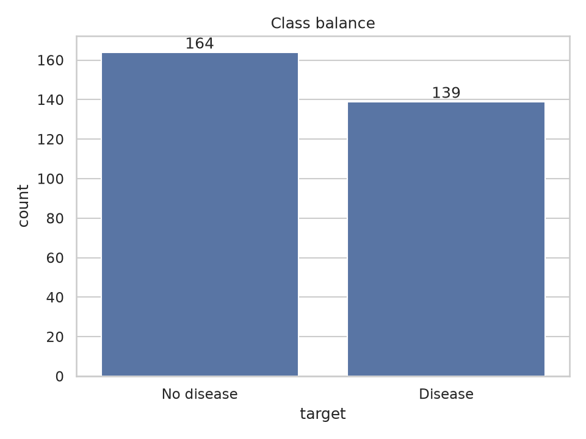

**Distributions.** Age is roughly bell-shaped around 54-56. Patients with disease tend to be older, have a lower maximum heart rate (`thalach`) and higher ST depression (`oldpeak`). Cholesterol has a long right tail (maximum 564 mg/dl), which motivates scaling.

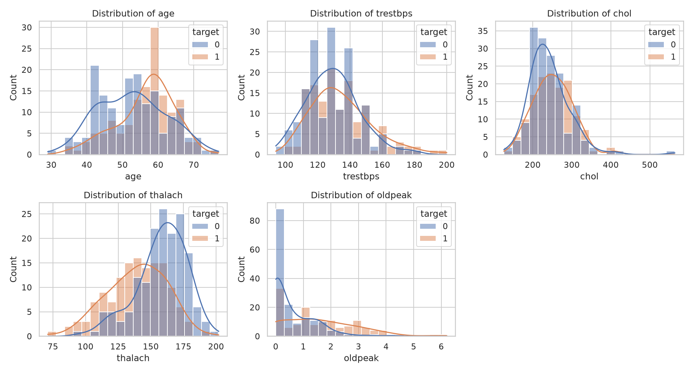

**Categorical features.** Asymptomatic chest pain (`cp = 4`), reversible-defect thalassemia (`thal = 7`), exercise-induced angina and a higher number of blocked vessels (`ca`) are strongly associated with disease.

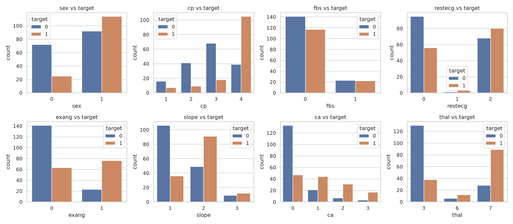

**Correlations.** The features most correlated with the target are `thal` (0.52), `ca` (0.46), `exang` (0.43), `oldpeak` (0.43), `thalach` (-0.42) and `cp` (0.41). `chol`, `fbs` and `trestbps` are weak predictors on their own. The only notable inter-feature correlation is `oldpeak` with `slope` (0.58), which is mild enough not to require removing either.

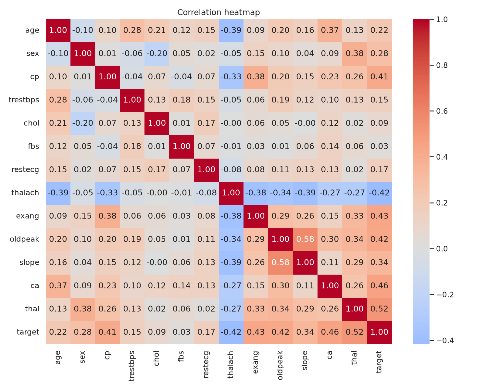

## 4. Feature Engineering and Modelling

### 4.1 Preprocessing pipeline

All preprocessing lives in a single scikit-learn `ColumnTransformer` (`src/features.py`) that is part of the model object itself:

- **Numeric features** (`age, trestbps, chol, thalach, oldpeak`): median imputation, then standardisation.
- **Categorical features** (`sex, cp, fbs, restecg, exang, slope, ca, thal`): most-frequent imputation, then one-hot encoding with `handle_unknown="ignore"`.

Because the transformer is fitted inside each cross-validation fold, no statistics leak from validation data into training. Keeping it inside the saved pipeline also means the API receives raw feature values and cannot drift from the training-time transformation. `handle_unknown="ignore"` and the imputers make inference robust to unseen categories or missing values instead of crashing.

### 4.2 Models and tuning

The data were split once, stratified, into 242 training and 61 test rows (seed 42). The test set is touched only once, for the final report. Two models were tuned with `GridSearchCV` (5-fold stratified CV, scored on ROC-AUC) on the training set only:

| Model | Search space | Candidates | Best configuration |
|---|---|---|---|
| Logistic Regression | `C` in {0.01, 0.1, 1, 10}; `class_weight` in {None, balanced} | 8 | `C = 0.1`, `balanced` |
| Random Forest | `n_estimators` in {100, 300}; `max_depth` in {3, 5, None}; `min_samples_leaf` in {1, 3, 5} | 18 | 300 trees, no depth limit, `min_samples_leaf = 5` |

ROC-AUC was chosen as the selection metric because it is threshold-independent and robust to mild imbalance. Regularisation strength (`C`) and `min_samples_leaf` are the main levers against over-fitting on a 242-row training set.

### 4.3 Results

Each tuned model was re-evaluated with 5-fold cross-validation on the training data (mean ± standard deviation), then scored once on the held-out test set.

| Model | Accuracy | Precision | Recall | F1 | ROC-AUC |
|---|---|---|---|---|---|
| Logistic Regression - CV | 0.830 ± 0.017 | 0.823 ± 0.043 | 0.810 ± 0.068 | 0.813 ± 0.023 | **0.903 ± 0.017** |
| Random Forest - CV | 0.810 ± 0.032 | 0.810 ± 0.055 | 0.774 ± 0.083 | 0.787 ± 0.039 | **0.902 ± 0.033** |
| Logistic Regression - test | 0.885 | 0.839 | 0.929 | 0.881 | 0.965 |
| Random Forest - test | 0.852 | 0.806 | 0.893 | 0.847 | 0.948 |

**Model selection.** Cross-validated ROC-AUC is effectively tied (0.903 vs 0.902), but Logistic Regression has lower variance across folds, better recall and F1, is far cheaper to serve and is directly interpretable. It is therefore the model that is packaged and deployed. The test scores agree with the ordering, but with only 61 test rows a single patient moves recall by about 3.5 points, so the cross-validation figures are the more reliable comparison.

On the test set, Logistic Regression produced 28 true negatives, 5 false positives, 2 false negatives and 26 true positives. The bias towards false positives over false negatives (encouraged by `class_weight="balanced"`) is the preferable direction for a screening tool.

| Logistic Regression | Random Forest |
|---|---|
| 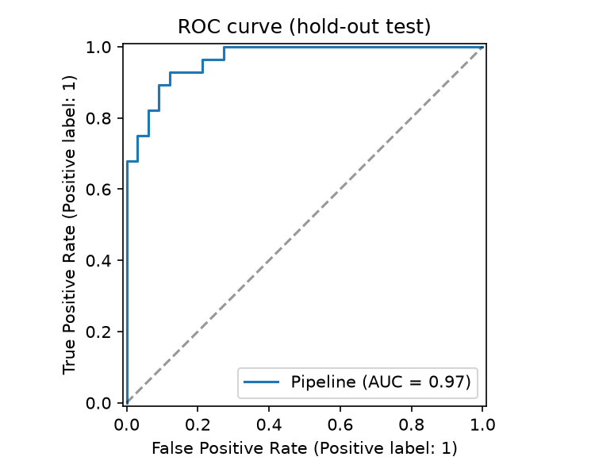 |  |
| 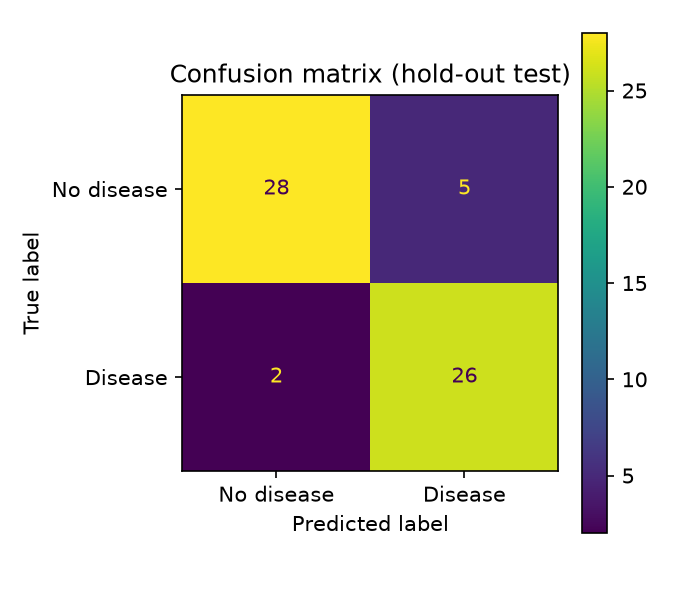 |  |

**Interpretation.** The largest logistic-regression coefficients are `ca = 0` (-0.70, no blocked vessels lowers risk), `cp = 4` (+0.58, asymptomatic chest pain), `thal = 7` (+0.51) and `thal = 3` (-0.48). This matches the EDA and clinical expectation, which is reassuring evidence that the model is learning real signal.

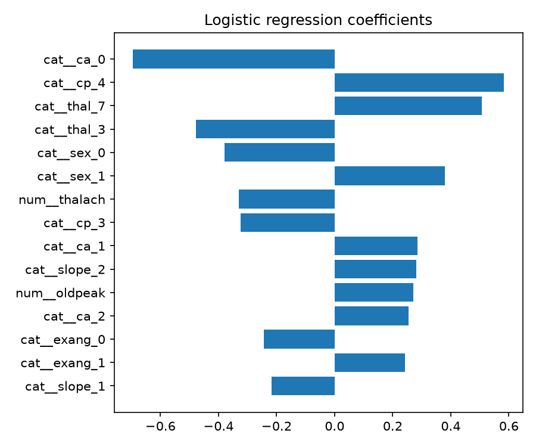

## 5. Experiment Tracking (MLflow)

Every training run is logged to MLflow (`sqlite:///mlflow.db`, experiment `heart-disease-classification`). One parent run is created per model, and each grid-search candidate is logged as a nested child run, giving 28 runs in total (2 parents, 8 Logistic Regression candidates, 18 Random Forest candidates).

**Logged for each model run:**

- **Parameters:** best hyper-parameters, number of folds, split size, train/test row counts and the feature list.
- **Metrics:** CV mean and standard deviation for accuracy, precision, recall, F1 and ROC-AUC, plus the hold-out `test_*` metrics.
- **Artifacts:** ROC curve, confusion matrix, feature-importance plot, the cleaned dataset, `requirements.txt` and the fitted model with an input example.
- **Child runs:** parameters and CV ROC-AUC (mean and standard deviation) for every grid point, which makes the tuning process auditable.

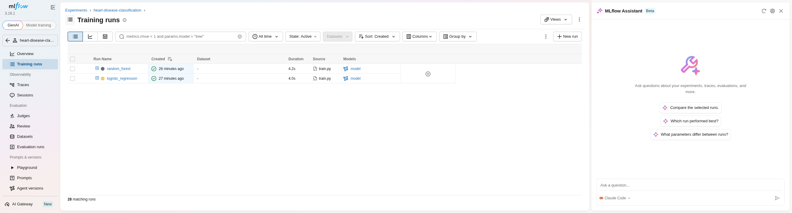

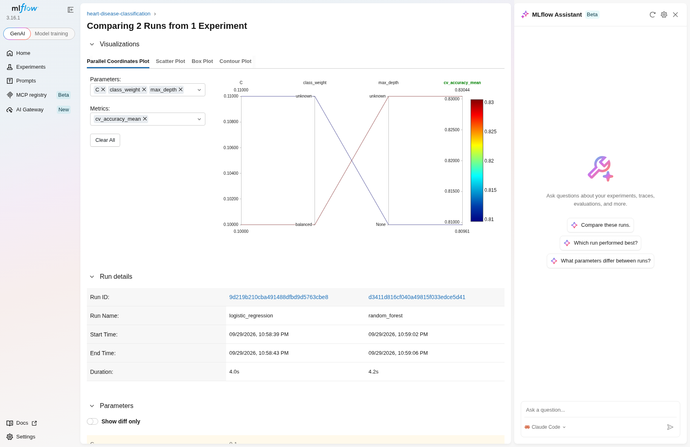

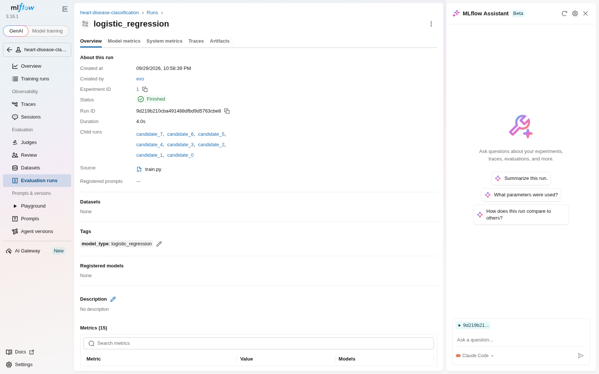

Two practical issues surfaced while integrating MLflow 3.16. First, its default `skops` serialisation rejected the pipeline (an untrusted `numpy.dtype`), so the model is logged with `cloudpickle`. Second, integer columns in the model signature would make the served model reject float JSON, so the input example is cast to `float64` to declare the signature as floating-point.

## 6. Model Packaging and Reproducibility

- **Model artefact.** After training, the model with the highest CV ROC-AUC is saved with joblib to `models/model.joblib`, alongside `models/model_metadata.json` (model name, hyper-parameters, feature order, CV and test metrics and the MLflow run id). The metadata makes each deployed model traceable back to its experiment.
- **Full pipeline in one object.** Imputation, scaling and encoding are inside the saved pipeline, so inference needs no separate preprocessing code. `src/predict.py` exposes `load_model()` and `predict()`, shared by the CLI and the API.
- **Pinned dependencies.** `requirements.txt` pins every direct dependency to the exact version used. `requirements-api.txt` is a slimmer subset for the container, without MLflow, matplotlib or seaborn.
- **Determinism.** The random seed is fixed to 42 and the split is stratified; re-running training gives identical metrics.

## 7. Testing and CI/CD

### 7.1 Unit tests

The test suite has **22 tests** in four files (`tests/`):

| File | What it covers |
|---|---|
| `test_data_processing.py` | Missing-value imputation, target binarisation, no mutation of the input frame, integer categoricals, de-duplication, `?` handling |
| `test_features.py` | No NaNs after preprocessing, standardised numeric output, unseen category tolerance, missing values at inference |
| `test_model.py` | Both models fit and give valid probabilities, search grids reference real parameters, metric dictionary, prediction output format |
| `test_api.py` | `/health`, `/predict` success, 422 on missing or out-of-range input, `/metrics` counters, `/metrics` not self-counted, request logging |

Tests use small synthetic frames, so they are fast (about 3 seconds) and do not depend on network access.

### 7.2 GitHub Actions pipeline

`.github/workflows/ci.yml` runs on every push and pull request with two jobs:

1. **build-test-train:** install pinned dependencies, lint with flake8, download and prepare data, run pytest (JUnit XML output), train the models (output tee'd to a log), and upload the model, test report, training log, processed data and MLflow store as workflow artifacts. The upload step runs even when an earlier step fails so that logs are always available.
2. **docker:** build the image, start the container, wait for `/health`, then call `/predict` and assert the expected class and a confidence between 0.5 and 1.

**Failure behaviour.** Each step is fatal by default, so a lint error, a failing test, a training exception or a broken container fails the run. The training step uses `shell: bash` explicitly because GitHub's default shell does not enable `pipefail`, without which `train | tee` would have masked a training failure. This was verified locally by adding a deliberately failing test (pytest exited with code 1).

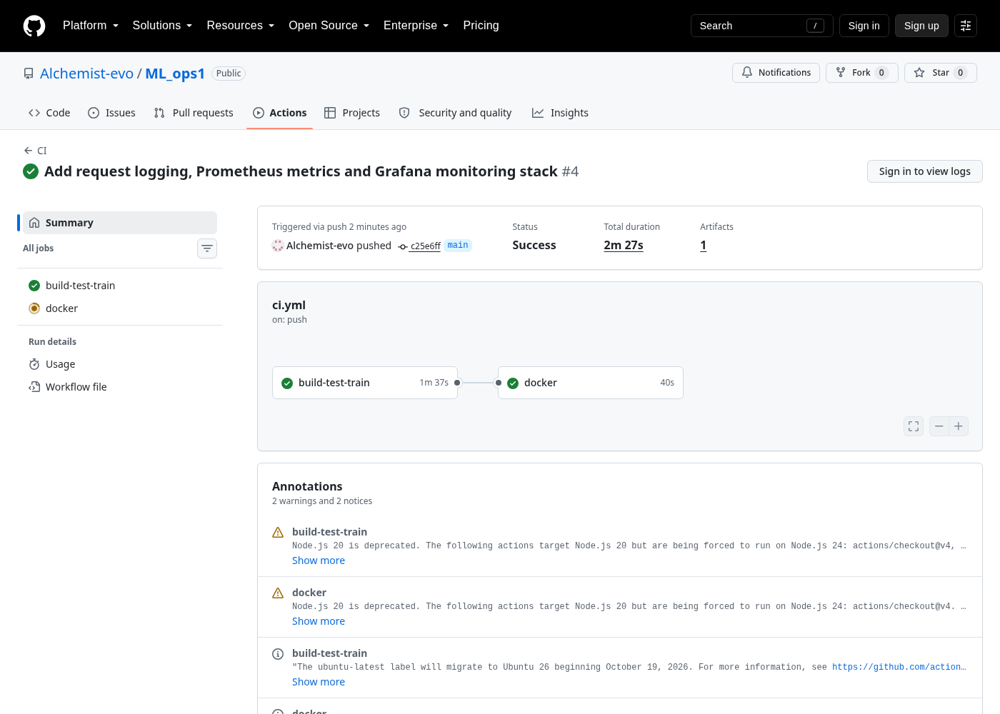

## 8. Containerisation

The API (`src/api.py`, FastAPI) exposes:

| Endpoint | Purpose |
|---|---|
| `POST /predict` | JSON with the 13 features -> `prediction`, `label`, `probability_disease`, `confidence` |
| `GET /health` | Liveness/readiness, reports the loaded model name |
| `GET /metrics` | Prometheus metrics |
| `GET /docs` | Interactive Swagger UI |

Requests are validated with Pydantic, with clinically plausible ranges per field, so malformed input returns HTTP 422 rather than a wrong prediction. Confidence is the probability of the predicted class.

Example request and response:

```json
{"age":67,"sex":1,"cp":4,"trestbps":160,"chol":286,"fbs":0,"restecg":2,
 "thalach":108,"exang":1,"oldpeak":1.5,"slope":2,"ca":3,"thal":3}

{"prediction":1,"label":"disease","probability_disease":0.9286,"confidence":0.9286}
```

**Dockerfile design:** `python:3.14-slim` base; dependencies installed before source is copied (better layer caching); only `src/` and `models/` are copied in (a `.dockerignore` excludes data, tests, notebooks and MLflow state); the process runs as a non-root user; and a `HEALTHCHECK` polls `/health`.

The image was built and run locally, and returned correct predictions for two test patients (one disease, one healthy). The same build-run-predict check runs in CI on a clean runner.

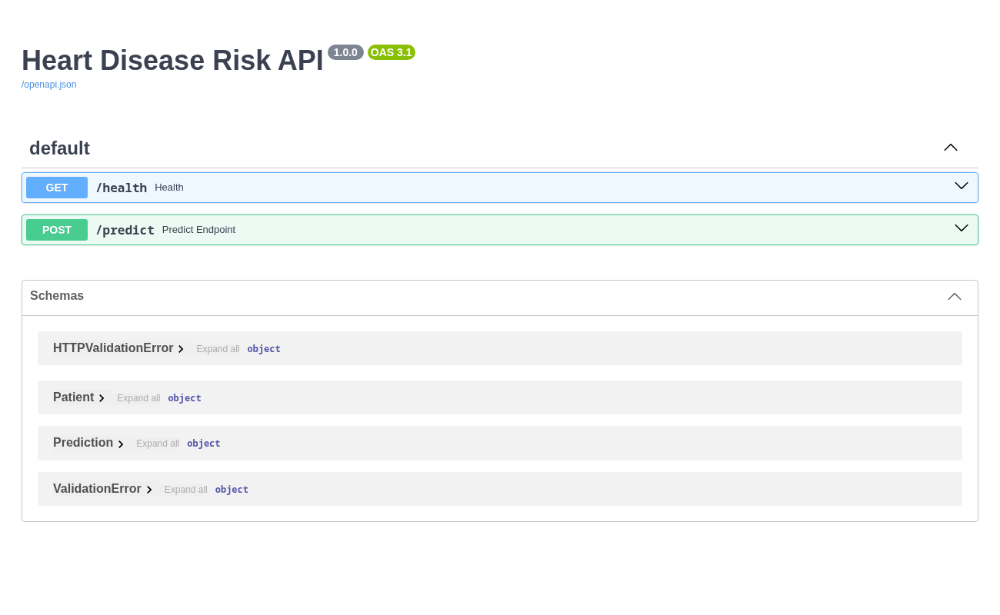

## 9. Production Deployment (Kubernetes)

The service is deployed to a local **Minikube** cluster (Kubernetes v1.35.1, Docker driver) using the manifests in `k8s/`:

- **Deployment** (`deployment.yaml`): 2 replicas; a rolling update strategy with `maxUnavailable: 0` so a rollout never reduces capacity; readiness and liveness probes on `/health`; CPU/memory requests (100m / 256Mi) and limits (500m / 512Mi).
- **Service** (`service.yaml`): type `LoadBalancer`, port 80 forwarding to container port 8000.
- **`scripts/deploy_minikube.sh`:** builds the image with an explicit version tag, loads it into Minikube and applies the manifests.

Verification on the live cluster:

```text
NAME                                     READY   STATUS    RESTARTS
pod/heart-disease-api-698c944647-ppszt   1/1     Running   0
pod/heart-disease-api-698c944647-rhkdl   1/1     Running   0

NAME                        TYPE           CLUSTER-IP       EXTERNAL-IP   PORT(S)
service/heart-disease-api   LoadBalancer   10.102.143.201   <pending>     80:31706/TCP
```

`/health` returned `ok`, `/predict` returned correct predictions for a disease and a no-disease patient, invalid input returned 422, and requests were distributed across both pods (21 and 24 hits in their respective logs).

**External access.** On Minikube, a `LoadBalancer` service only receives an external IP while `minikube tunnel` is running, and the tunnel needs root to add a network route. In the test environment it was not run, so `EXTERNAL-IP` stays `<pending>`; the service is reached through its NodePort instead (`http://192.168.49.2:31706`). On a managed cloud cluster (GKE, EKS, AKS) the same manifest receives a cloud load balancer address automatically.

**A deployment lesson.** After the API was instrumented, the first redeploy silently kept running the old image: `minikube image load` does not overwrite an existing tag, and pods kept serving code without `/metrics`. Prometheus exposed this immediately (targets down with 404). The fix was to version the image tag explicitly (`1.1.0`) in both the manifest and the deploy script, rather than reusing `latest`.

## 10. Monitoring and Logging

### 10.1 Logging

Every request is logged in a structured, greppable form, for example `method=POST path=/predict status=200 duration_ms=4.1`. Every prediction additionally logs its predicted class, probability and confidence. Logs are read with `kubectl logs deploy/heart-disease-api`.

### 10.2 Metrics

The API exposes Prometheus metrics at `/metrics`:

| Metric | Type | Labels |
|---|---|---|
| `api_requests_total` | counter | method, endpoint, status |
| `api_request_latency_seconds` | histogram | endpoint |
| `model_predictions_total` | counter | label (disease / no disease) |
| `model_prediction_confidence` | histogram | - |

The endpoint label uses the route template rather than the raw URL, and `/metrics` does not count itself; both keep label cardinality low and the numbers meaningful.

### 10.3 Prometheus and Grafana

Prometheus and Grafana are deployed into the cluster from `k8s/monitoring/`. Prometheus discovers the API pods through the Kubernetes API (so scraping keeps working as pods are replaced) using a least-privilege `Role` limited to pod read access, and scrapes every 10 seconds. Grafana starts with the Prometheus data source and a seven-panel dashboard pre-provisioned from a ConfigMap, so nothing has to be configured by hand.

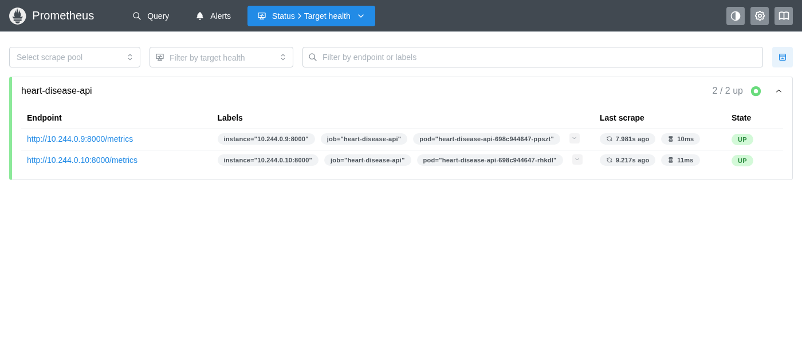

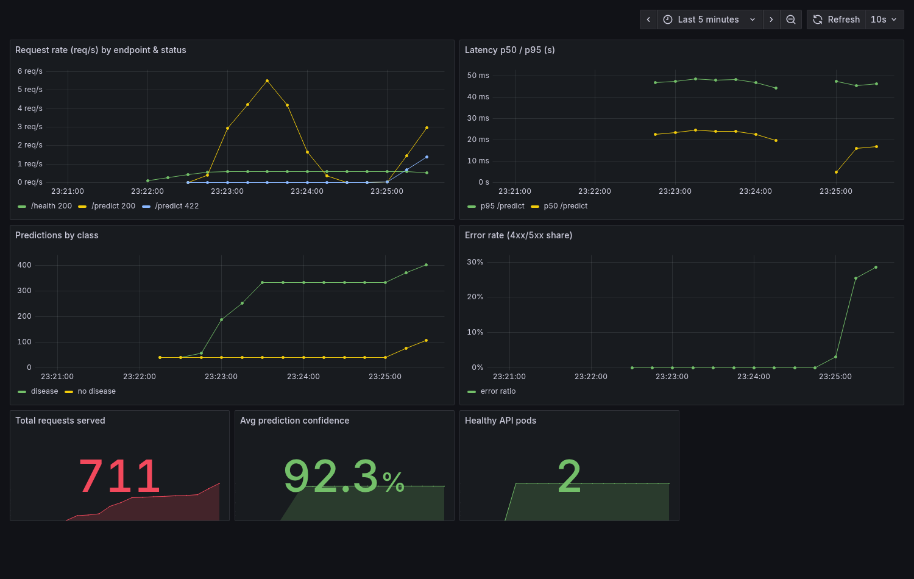

With sustained traffic the dashboard showed about 5.5 requests/second on `/predict`, **p95 latency of 48 ms** and both pods healthy. The error-ratio panel rises to roughly 28% in the screenshot; this is expected, because the load generator deliberately sends some invalid requests to exercise the 422 path and the panel. The class split in the predictions panel simply reflects the fixed test patients used by the load generator, not real-world case mix.

## 11. Limitations and Future Work

- **Small dataset.** 303 rows means wide uncertainty: the CV standard deviation is 2-8 points and the 61-row test set is noisy. Results should not be read as clinical performance.
- **Not a medical device.** The model is a demonstration of MLOps practice; it has not been clinically validated and must not be used for diagnosis.
- **Imputation before the split.** The cleaned CSV is median-imputed using the whole dataset before the train/test split. Only 6 cells are affected, and the model pipeline has its own imputers fitted inside each fold, so the impact is negligible; a stricter design would leave NaNs in the CSV and impute only inside the pipeline.
- **Calibration and threshold.** The 0.5 decision threshold is not tuned for a screening use case (where recall matters most), and probabilities are not explicitly calibrated.
- **Monitoring gaps.** There is no data-drift or model-quality monitoring, since labels are not available online. No alerting rules are defined.
- **Deployment hardening.** The cluster is local; production would add an Ingress with TLS, a HorizontalPodAutoscaler, image scanning and a registry-based (rather than `image load`) release flow.

## 12. Conclusion

The project delivers the full lifecycle for a small but realistic model: a reproducible, tested training pipeline; tracked experiments; a validated container; a Kubernetes deployment with health-checked replicas; and live metrics, logs and a dashboard. Logistic Regression (CV ROC-AUC 0.903, test ROC-AUC 0.965, test recall 0.93) was selected on cross-validated performance and simplicity. The CI pipeline enforces lint, tests, training and a container smoke test on every change, and fails loudly when any of them break.

## Appendix A - Repository layout

```text
ML_ops1/
├── src/                 download, cleaning, EDA, features, models, train, tracking, predict, api
├── tests/               22 pytest unit tests
├── data/                raw/ and processed/ datasets
├── models/              model.joblib, model_metadata.json
├── k8s/                 deployment.yaml, service.yaml, monitoring/
├── scripts/             deploy_minikube.sh, diagram and report builders
├── reports/             report.md / report.pdf, figures/, evidence logs
├── screenshots/         MLflow, Actions, Swagger, Prometheus, Grafana
├── .github/workflows/   ci.yml
├── Dockerfile, requirements.txt, requirements-api.txt
```

## Appendix B - Architecture diagram


